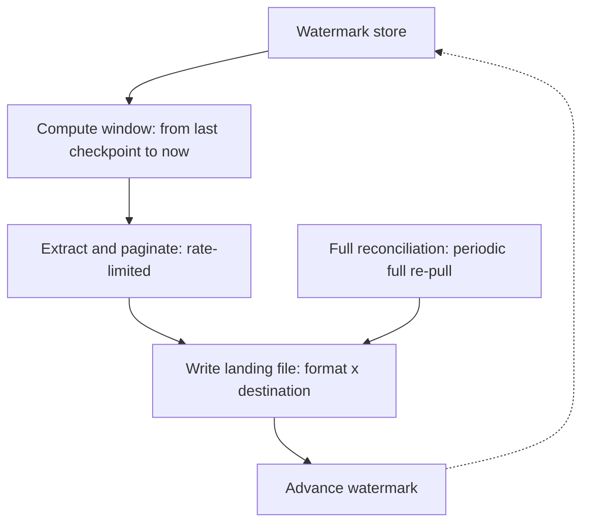

# Last.fm scrobble exporter — PRD

2026-09-18 · @Someone

## Overview

Individuals accumulate years of listening history on Last.fm with no supported way to move it into their own data platform. This tool exports a user's complete scrobble history from the Last.fm API, keeps it current with safe repeated runs, and lands it in a format and location that a platform like Microsoft Fabric can pick up.

It is a read-only extraction and landing tool: it pulls, filters, windows, and writes data. It does not merge, deduplicate, or transform data into a final table, that step is explicitly left to whoever consumes the landing zone. It is built to be reused: a second person, with their own Last.fm account and API key, should be able to install it and run their own export without reading this document's design rationale, only its usage instructions.

## Goals and non-goals

**Goals**

- Complete, correct historical backfill of a user's scrobble history
- Safe incremental updates on a recurring schedule, with no data loss and no unbounded duplication
- Output flexible across format and destination, so it fits whatever platform is downstream
- Packaged and documented well enough that someone other than the author can run their own export

**Non-goals**

- Not a merge or dedup engine. The tool lands immutable per-window files; merging into a target table is a downstream concern (a Fabric pipeline, a notebook, a warehouse job), not this tool's job
- Not a general Last.fm API client. Covers `user.getRecentTracks` (scrobble history) only, not top artists, charts, or other endpoints
- Not a fuzzy duplicate detector. Genuine multi-client double-scrobbles (e.g. Spotify and Last.fm both scrobbling the same play) land as two separate rows by design; resolving those needs a proximity-based rule, treated as a separate, optional tool
- No write access to Last.fm. Read-only: no scrobbling, no track corrections, no deletions
- No UI. CLI only

## Users and personas

| Persona | Need | Interaction |
| --- | --- | --- |
| Primary: individual technical user | Wants their own scrobble history in a data platform for analysis | Installs via pip, configures one username, runs on a schedule or ad hoc |
| Secondary: operator for a small group | Wants to track several people's histories with one deployment | Configures a list of usernames, each with an isolated watermark; likely runs it unattended (Docker/cron/k8s CronJob) |

Both personas are technical enough to edit a TOML file and set an environment variable. Neither requires a GUI.

## Extraction and incremental load

**Extraction**

- Paginate `user.getRecentTracks` fully, `limit=200` per page, following `totalPages`
- Drop any track with no `date` element (the in-progress "now playing" entry), regardless of the `nowplaying` attribute
- Throttle to a fixed ~2.5 req/s, below the ToS-referenced 5 req/s ceiling
- Retry on error codes 11, 16, 29 with exponential backoff; when a Retry-After header is present on the response, honor it in place of the computed backoff interval; fail fast on non-retryable codes (e.g. 10, 26)
- Each request carries a connect and read timeout; a timeout is treated as retryable, the same as a transient service error

**Incremental windowing**

- Each run computes a bounded window `[from, to)`, with `to` fixed at run start. Pagination never runs over a set that can still grow underneath it
- A durable per-user watermark (last successfully committed `to`) is the source of `from` for the next run
- Every run re-pulls a trailing overlap in addition to the new window (default 7 days, configurable), to catch scrobbles submitted late by offline-capable clients
- The watermark advances only after the window's data has been written successfully. A crashed run leaves the watermark untouched and is safe to retry

**Reconciliation**

- A separate, lower-frequency full re-pull of the entire history (cadence configurable, weekly proposed as default) lands its own file set for downstream reconciliation, since incremental windows cannot observe edits or deletions upstream. A full re-pull alone doesn't detect a deletion on its own, that needs diffing the new reconciliation file's key set against the previous one, see Open questions on where that diff runs
- `--full-resync` triggers this on demand, for initial backfill or manual recovery. For a large history (this deployment's biggest account is ~180,000 scrobbles), a single unbounded pull is fragile against a mid-run crash; chunking it into time-bounded sub-windows, one per calendar year for example, each committing its own progress, bounds an interruption to one sub-window instead of the whole backfill

## Output layer and natural key

**Format and destination are independent config axes**

| Format | Destinations |
| --- | --- |
| JSON Lines | local disk, S3, Azure Blob, OneLake/ADLS Gen2 |
| CSV | local disk, S3, Azure Blob, OneLake/ADLS Gen2 |
| Parquet | local disk, S3, Azure Blob, OneLake/ADLS Gen2 |

Destinations are plain URIs (`file://`, `s3://`, `az://`/`abfss://`) resolved through `fsspec`, with credentials via each cloud's native chain (boto3 chain for S3, `DefaultAzureCredential` for Azure, several explicit options rather than only identity-based auth: DefaultAzureCredential (managed identity, Azure CLI login), a connection string, an account key, or a SAS token, since a self-hosted deployment without Entra ID integration often needs the simpler ones). No bespoke auth or upload logic.

**File naming**: `{username}_{from_uts}_{to_uts}.{ext}`, one immutable file per run window, the path is partitioned by year and month of the window's to boundary (for example username=wesley/year=2026/month=09/...) so Fabric or Spark can prune partitions instead of scanning every file. Re-running the same window overwrites the same key rather than creating a duplicate. JSON output is written as JSON Lines, not a single top-level array, so it stays append-friendly and streamable.

**Row schema**

| Field | Type | Notes |
| --- | --- | --- |
| `username` | string | The tracked Last.fm username, explicit on every row so downstream unions across users don't depend on parsing the filename |
| `artist` | string | As returned by the API |
| `artist_mbid` | string, nullable | MusicBrainz ID, often empty at scrobble time |
| `track` | string | As returned by the API |
| `track_mbid` | string, nullable | Often empty at scrobble time |
| `album` | string, nullable |  |
| `album_mbid` | string, nullable |  |
| `scrobbled_at_uts` | integer | Raw UTC Unix timestamp, canonical, the only time field in the natural key |
| `scrobbled_at_utc` | datetime (UTC) | Human-readable form of `scrobbled_at_uts` |
| `scrobbled_at_local` | datetime (tz-aware) | `scrobbled_at_uts` converted to the tracked user's configured time zone, see Non-functional requirements for DST handling |
| `url` | string | Last.fm track URL |
| track\_title\_clean | string | Derived from track: casing corrected only when the source is uniformly upper or lower case; trailing annotation segments removed via a maintained keyword list. Excluded from the natural key, see Title cleansing |
| featured\_artists | array of strings, nullable | Extracted from a trailing feat./featuring/ft. segment before annotation stripping runs; empty when the title carries no featuring credit |

`scrobbled_at_local` is a display and analysis convenience, not identity. It reflects the user's configured home time zone, not necessarily where they physically were when the track played, Last.fm does not report that (see Open questions).

**Natural key**: `(username, uts, artist_name, track_name)` as returned by the API, hashed into one surrogate key column for a simpler downstream `MERGE ON`. `mbid` and `album` are excluded from the key and carried as payload columns instead, both are enrichment fields subject to later correction, and a key built on a field that can change under a stable event produces a duplicate row instead of an update. `scrobbled_at_local` is excluded from the key for the same underlying reason: a civil wall-clock time is ambiguous or even non-existent across a daylight-saving transition, so it cannot safely anchor row identity. The raw `scrobbled_at_uts` remains the only time component in the key.

This key makes the extractor's own output idempotent under retries and overlapping windows. It does not deduplicate genuine multi-client double-scrobbles already present in the source data (see Non-goals).

## Title cleansing

Two separable problems, each needing a different, narrow mechanism. A single blind transformation risks eating real title content.

**Casing**: only correct it when the source casing is degenerate, the whole title in ALL CAPS or all lowercase. A mixed-case title is left untouched. Most scrobble sources already submit correctly cased titles, the real problem is the minority from weaker sources coming through uniformly upper or lower case. This sidesteps an algorithmic title-caser breaking intentional stylization (`deadmau5`, `P!nk`), since those are already mixed-case and never touched.

**Annotation removal**, two filters, both must pass:

- Position: only a trailing parenthetical, bracket, or dash-suffix is a candidate. A parenthetical elsewhere is structural, not noise, "(I Can't Get No) Satisfaction" and "(Sittin' On) The Dock of the Bay" both lead with one, so a trailing-only rule leaves them alone automatically
- Content: a trailing segment is removed only if it matches a maintained keyword list (remaster/remastered, live, acoustic, radio edit, single version, deluxe, bonus track, mono, stereo, extended mix, unplugged, instrumental, demo, alternate take, and so on), never on the mere presence of parentheses. Strip iteratively, some titles stack more than one segment
- A bare number is never sufficient on its own. "1999" is a complete Prince song title; stripping trailing years alone would destroy it. A year only matters inside a segment that already matched a keyword ("2011 Remaster")

**Non-destructive by construction**: `track` stays untouched, `track_title_clean` is a new derived field. Cleansing a corpus this varied will misfire on some fraction of titles regardless of ruleset care, keeping the original makes a misfire recoverable rather than a silent loss. Like `scrobbled_at_local`, the clean title is excluded from the natural key, it's a re-derivable heuristic, not a stable identifier, so refining the ruleset later must not spawn duplicate rows.

The keyword list is config, extended over time the same way the retryable error-code list is, not hardcoded logic. Changes to it are checked against a fixed regression set of adversarial titles that must survive untouched: "(I Can't Get No) Satisfaction", "1999", "Happy (from Despicable Me 2)", "99 Luftballons", "(Sittin' On) The Dock of the Bay".

**Featuring credits**: extracted before the annotation-removal pass runs, not treated as ordinary noise. A trailing "feat. X", "featuring X", or "ft. X" segment is pulled into a new `featured_artists` field, then removed from the title text. Strictly more information-preserving than stripping it outright.

## Presentation schema

The row schema above is what lands in the raw extraction files, wide and technical, built for durability. Mbids, raw uts, and url stay there even though most day-to-day queries won't touch them, they cost little to carry and matter for future enrichment or debugging a bad merge. What gets queried day to day in Fabric is narrower, built as a view or curated table over the merged landing data, and there's no reason its column names need to match the landing schema's.

| Column | Source | Notes |
| --- | --- | --- |
| username | username |  |
| artist | artist |  |
| title | track |  |
| cleantitle | track\_title\_clean |  |
| scrobbletime | scrobbled\_at\_utc | Full ISO 8601 UTC, not display-truncated; this precision is what makes it usable as the merge-key time component too, no separate raw-epoch column needed here |
| localscrobbletime | scrobbled\_at\_local | Same precision requirement, tz-aware ISO 8601 |
| image | image, one size only | See below |
| album | album | Closes album-level reporting (most-played albums, grouping by release) |
| artist\_mbid | artist\_mbid | Stable join key for future enrichment, genre, country, formation year |

**Two likely gaps, worth a deliberate yes or no rather than a silent omission**

- **album**: not in the list above. If album-level reporting (most-played albums, grouping tracks under a release) matters, it needs to be captured now, it can't be reconstructed later from artist and title alone
- **artist\_mbid**: text artist names collide and get renamed over time; the MusicBrainz ID is the stable join key for future enrichment against an external catalog (genre, country, formation year). Track and album mbids are far sparser in practice and probably aren't worth carrying into presentation, artist mbid is the one that's reliably populated

**Image**: pick one size, not all four. Last.fm returns small/medium/large/extralarge as separate URLs for the same underlying asset, carrying all four is redundant. `extralarge` for report-quality visuals, `large` for a lighter column. Caveat: Last.fm serves a generic placeholder image when no real artwork exists for a release, the field doesn't reliably mean art is actually present.

## Reusability and packaging

**Configuration** (TOML, read via stdlib `tomllib`)

- A list of tracked usernames, each with its own watermark and optionally its own destination override
- Global defaults for format, destination, overlap window, and reconciliation cadence
- API key referenced by environment variable name, never inlined
- Per-user IANA time zone (e.g. `Europe/Brussels`), used to compute `scrobbled_at_local`; defaults to UTC if omitted, with a logged warning

**CLI** (stdlib `argparse`)

- Run for all configured users, or a single user override
- `--full-resync`: force a full historical re-pull
- `--dry-run`: validates configuration, credentials, and destination connectivity, no Last.fm API calls and no file writes, since testing shouldn't touch either API quota or the Reasonable Usage Cap
- `--since`: override the watermark, for backfills or manual recovery
- A console progress bar (rows fetched, pages, ETA) for interactive runs, suppressed automatically when output isn't a TTY so scheduled runs get clean structured logs instead

**Packaging**

- `pyproject.toml` with `hatchling`, a console-script entry point, so the install-to-run path is `pip install lastfm-export` then `lastfm-export <username>`
- Cloud-specific dependencies (`s3fs`+`boto3`, `adlfs`+`azure-identity`) as optional extras (`[aws]`, `[azure]`), not forced on every installer
- An optional Docker image (`python:3.12-slim`, non-root user) for unattended, scheduled runs. This is a second interface for automation, not a replacement for the pip-installable CLI, which stays the lowest-friction path for a one-off export

## Operations

Not covered elsewhere, and needed before this runs unattended.

**Structured logging**: rows extracted, rows skipped as now-playing, pages fetched, retries and their cause, run duration, per user per run.

**Failure signaling**: a failed run exits non-zero and leaves the watermark untouched, that part's already required, but nothing currently surfaces the failure to a person. A scheduled deployment needs that wired to something actually seen, an email on non-zero exit, a webhook, a cluster alert, otherwise a broken run for one of the tracked users can sit silently for weeks.

**Status command**: `lastfm-export status` reads the watermark store and reports, per user, the last successful run and how far behind now that watermark sits. The tool for answering "is data flowing" without opening the landing zone directly, and what a failure alert should point someone at.

## Non-functional requirements

- **Rate-limit compliance**: never knowingly exceed Last.fm's documented ceiling; build to the historically-cited 5 req/s figure with margin (target ~2.5 req/s) regardless of the current, vaguer ToS wording
- **Idempotency**: any window, including an overlapping one, can be re-run arbitrarily many times without creating duplicate or lost rows in the landing zone
- **Dependency minimalism**: mandatory install is httpx, polars, fsspec only; cloud SDKs are opt-in extras
- **Cross-platform**: runs on Linux as the primary target, makes no OS-specific assumptions
- **No secrets in source control**: API keys and cloud credentials via environment variables, mounted files, or each cloud's native credential chain only
- **Correct local time conversion**: `scrobbled_at_uts` to `scrobbled_at_local` uses the IANA time zone database (`zoneinfo`, stdlib since Python 3.9) keyed to each user's configured time zone, so daylight-saving transitions are handled correctly rather than via a fixed UTC offset
- **Storage retention**: landing files are pruned once their data is confirmed merged downstream; the Reasonable Usage Cap is a point-in-time ceiling on what's currently held, not a lifetime total, so active pruning is a compliance lever, not just housekeeping
- **Atomic writes**: a landing file is written to a temporary path and atomically moved into place; a landing file that exists is always complete, never a partial write left behind by an interrupted run
- **Concurrency guard**: two runs for the same user must not execute concurrently; a lock or lease on that user's watermark record prevents a race that could corrupt or skip a window
- **Secret redaction**: API keys, connection strings, SAS tokens, and account keys are masked in all logged output, including error paths and exception messages, never just excluded from source control

## Architecture and stack

| Layer | Choice | Why |
| --- | --- | --- |
| Language | Python 3.11+ | I/O-bound job throttled externally at ~4-5 req/s; runtime speed doesn't move total time, ecosystem maturity for Parquet and cloud SDKs does |
| HTTP client | httpx (sync) | No benefit from async here, the rate limiter is the bottleneck either way |
| Serialization | polars | Fast Parquet writer, no separate `pyarrow` dependency required |
| Destination abstraction | fsspec (+ s3fs, adlfs as extras) | One write path for local disk, S3, Azure Blob, and OneLake/ADLS Gen2 |
| Config | TOML via stdlib `tomllib` | Zero new dependency, natural fit for multi-user / multi-destination config |
| CLI | stdlib `argparse` | Current flag surface doesn't justify `click`/`typer` |
| Retry/backoff | Hand-rolled | Three retryable codes and fixed exponential backoff isn't worth a `tenacity` dependency |
| Testing | pytest + `httpx.MockTransport` | Dev-only, no extra dependency since `MockTransport` ships with httpx |
| Packaging | `pyproject.toml` + hatchling | Console-script entry point turns this into an installable CLI |
| Lint/format | ruff | One tool instead of stacking black + flake8 + isort |
| Scheduling (optional) | Docker (`python:3.12-slim`) | For unattended runs; not the primary interface |

## Open questions and risks

Every row below is resolved. Kept as a decision log with rationale, not a list of open blockers.

| Question | Current assumption | Needs |
| --- | --- | --- |
| Do `total`/`totalPages` reflect the full history or the `from`/`to`-filtered range? | Assumed filtered, unverified against the docs | Decided: proceeding on the filtered assumption without verification. Revisit only if incremental windows show boundary drift, missing or duplicated rows near a window edge |
| Last.fm's exact rate limit | Current live ToS says "sole discretion", no published number; historically-documented figure is 5 req/s averaged over 5 minutes | Decided: building to ~2.5 req/s, more conservative than the ~4 req/s originally proposed |
| Reasonable Usage Cap (100MB stored data, ToS 4.3.4) | Confirmed binding, not theoretical. ToS 4.3.4: the cap is 100MB of Last.fm Data "in total at any time" across the whole integration, all tracked users combined, not per user. At 4 users with the largest at 180,000 scrobbles, JSON Lines lands roughly 90-100MB for that one user alone (~550 bytes/row for the full schema), before the other 3 users, before overlap-window duplication, before reconciliation re-pulls | Parquet as the default landing format, columnar compression on this kind of repetitive categorical data plausibly brings total storage to the low tens of MB even across all 4 users, plus a retention policy pruning landing files once merged downstream, since "at any time" is a point-in-time ceiling, not a lifetime total |
| Reconciliation cadence | Weekly, proposed default | Confirmed |
| Fuzzy duplicate-scrobble detection | Out of scope for this tool | Confirmed out of scope for this tool |
| Is the configured per-user time zone the listener's actual location at play time? | No, it's a fixed configured home zone; Last.fm doesn't report per-scrobble location | Hard constraint, not a risk to revisit: the API carries no geographic data at all, so no amount of future engineering resolves this. Documented as a permanent limitation of scrobbled\_at\_local |
| Should feat./featuring credits be stripped, extracted to a new field, or left alone? | Confirmed: extract to a new featured\_artists field, then strip from cleantitle | Decided |
| Should album and artist\_mbid be carried into the presentation schema? | Confirmed: both included in the presentation schema | Confirm |
| Which OneLake/Fabric landing destination will actually be used? | Confirmed: ADLS Gen2 shortcut. Zero code in the extractor, it already just writes to a configured fsspec URI, Fabric consumes it via the shortcut without any OneLake-specific logic in the tool | Decided |
| Where does the reconciliation deletion-diff actually run? | A full re-pull alone doesn't detect deletions by itself; needs diffing the new reconciliation file's key set against the previous one | Confirmed: downstream in the merge job, using a standard MERGE's not-matched-by-source clause against the current table. Keeps the extractor stateless per window, it never needs to read back its own prior output |

## Success criteria

- [ ] A full backfill for a test account completes without errors and produces a landing file set covering the account's entire history
- [ ] Re-running the same window twice, including an overlapping one, produces no duplicate rows after a downstream merge on the natural key
- [ ] Killing the process mid-run and re-running it recovers correctly, the watermark never advances past a failed write
- [ ] A second person can `pip install` the package, supply only an API key and a username, and successfully export their own history unaided

## Suggested epic groupings

A sanity check for whatever the extraction pass produces, drafted from the sections above, not a substitute for that pass.

| Candidate epic | Scope | Source |
| --- | --- | --- |
| Core extraction engine | Pagination, now-playing filter, rate limiting, retries including Retry-After, timeouts | Extraction and incremental load |
| Incremental watermarking | Windowed pulls, overlap buffer, watermark store, concurrency guard | Extraction and incremental load, Non-functional requirements |
| Full reconciliation | Periodic full re-pull, chunked backfill, deletion-diff downstream | Extraction and incremental load |
| Landing and output | Format x destination matrix, partitioned file naming, natural key, atomic writes, storage retention | Output layer and natural key, Non-functional requirements |
| Title cleansing | Casing correction, annotation stripping, featured\_artists extraction, regression set | Title cleansing |
| Presentation schema | Curated view over the merged data | Presentation schema |
| Configuration and CLI | Multi-user TOML config, per-user time zone, CLI flags, progress bar | Reusability and packaging |
| Packaging and distribution | pip install, console entry point, optional extras, Docker image | Reusability and packaging |
| Operations | Structured logging, failure signaling, status command, secret redaction | Operations, Non-functional requirements |

Fabric landing itself is the ADLS Gen2 shortcut, a configuration step, not code. Probably a setup task somewhere, not its own epic.
